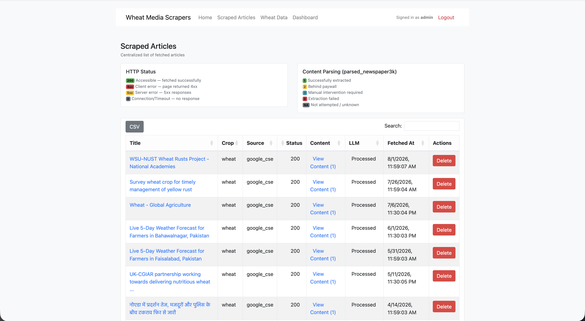
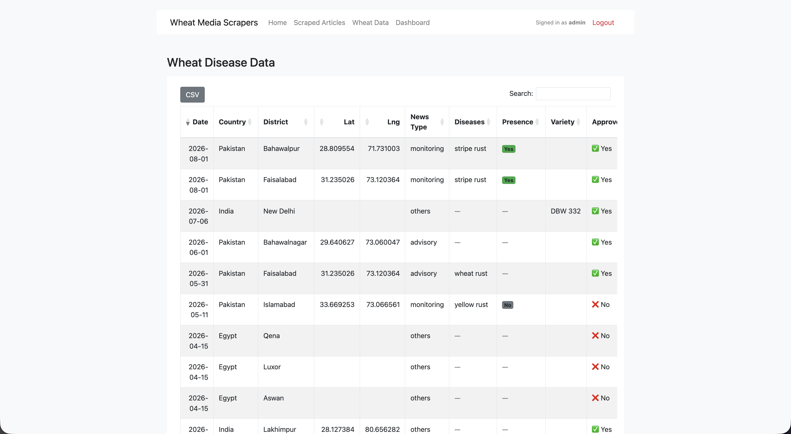
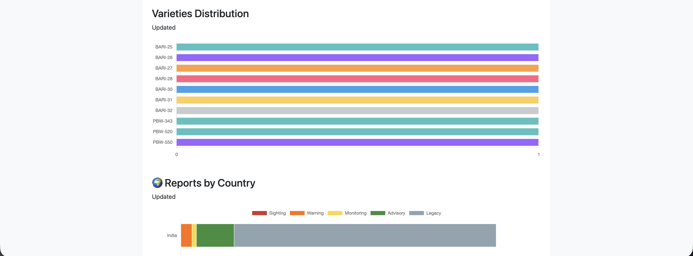
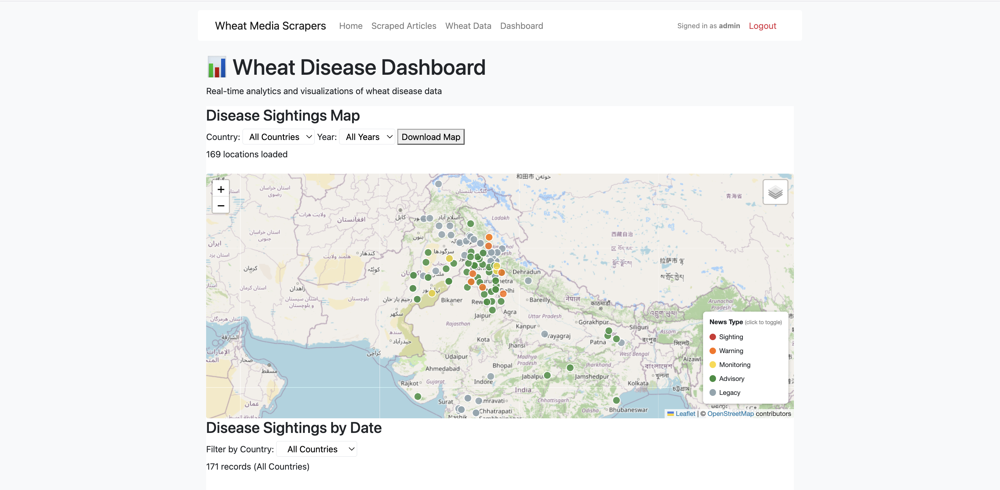

# Media Scraper

An automated system for collecting and analyzing news articles about agricultural issues from across South Asia.

## What It Does

This application automatically gathers news articles related to wheat diseases and agricultural concerns from multiple online sources, processes them with AI to extract key information, and organizes everything into an accessible database.

## Key Features

- **Automatic News Collection** – Continuously gathers articles from major news outlets
- **Smart Content Analysis** – Uses AI to identify important details like locations, dates, and disease types
- **Easy Access** – Provides an API to retrieve and filter the organized data
- **Regional Focus** – Specialized for South Asian agricultural news (Nepal, India, Bangladesh, Pakistan, Bhutan)

## Tech Stack

- **Backend**: Flask (Python)
- **Database**: SQLite with SQLAlchemy ORM
- **Content Extraction**: newspaper3k library for HTML parsing and article extraction
- **LLM Integration**: OpenRouter API with Mistral & DeepSeek models for structured data extraction
- **Frontend**: JavaScript with interactive data visualization
  - **Highcharts** – Interactive charts and statistical visualizations
  - **DataTables** – Advanced data grid with sorting, filtering, and pagination
- **Automation**: APScheduler for scheduled scraping and data collection
- **Deployment**: Docker & Docker Compose for containerized deployment
- **API**: RESTful endpoints with authentication

## Architecture & Key Processes

### Data Collection Pipeline
- Multi-source aggregation from Google News, NewsAPI, and GitHub
- HTTP validation with status code checking before processing
- Automated scheduling via APScheduler for continuous background data collection
- Configurable collection intervals and retry mechanisms

### Content Processing
- **URL Validation**: Filters articles by HTTP 200 response and domain authority
- **Text Extraction**: Uses newspaper3k to parse HTML and extract clean article text
- **Intelligent Parsing**: Handles varying article structures across different news sources

### LLM-Powered Feature Engineering
- **Structured Data Extraction**: Processes article text through LLM to extract:
  - Geographic location identification (country, district-level granularity)
  - Disease type classification and severity assessment
  - Wheat variety identification from agricultural context
  - Article categorization (outbreak sighting, warning, advisory, general news)
  - Keyword extraction and relevance scoring
  - Confidence scoring for data quality assurance

### Data Management
- **Duplicate Detection**: Prevents redundant data storage across multiple API calls
- **Status Tracking**: Maintains article processing status and retry logic
- **Database Optimization**: SQLite backend optimized for scalable deployments without PostgreSQL overhead

## API & Data Access

### RESTful Endpoints
- `GET /api/wheat_disease` – Retrieve records with filtering (country, district, date, type)
- `GET /api/wheat_disease/{id}` – Fetch individual article details
- `GET /api/wheat_disease/stats` – Get aggregated statistics and insights
- Basic authentication for secure API access

### Filtering & Analytics
- Multi-dimensional filtering (geographic, temporal, categorical)
- Statistical aggregation across datasets
- JSON response format for easy integration

## Features

- **Automated Scraping** – Scheduled data collection with no manual intervention
- **Regional Intelligence** – Specialized processing for South Asian agricultural contexts
- **Scalable Architecture** – Containerized deployment supporting variable load
- **Data Quality** – Duplicate detection, validation, and confidence scoring
- **REST API** – Easy programmatic access with authentication
- **Full-Text Analysis** – LLM-powered extraction vs. simple keyword matching
- **Interactive Dashboards** – Real-time data visualization with Highcharts for trends and statistics
- **Advanced Data Grid** – DataTables integration for searching, sorting, and filtering large datasets
- **Web Interface** – User-friendly dashboard for exploring and analyzing agricultural news data

### Dashboard Visualizations

## Quick Links

- 🌐 **Live Application**: https://mediascraper.saralcodes.xyz/
- 📖 **Full Documentation**: See technical documentation on the live site
